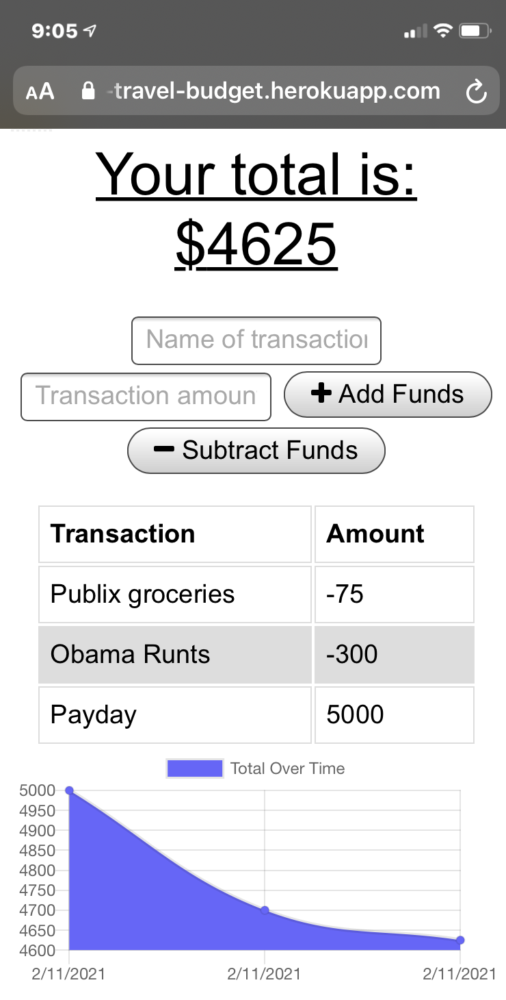
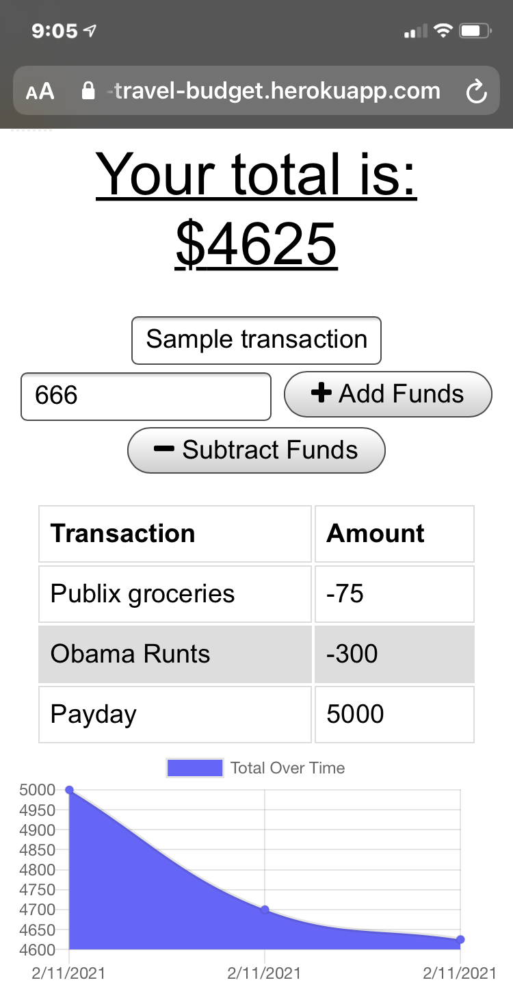
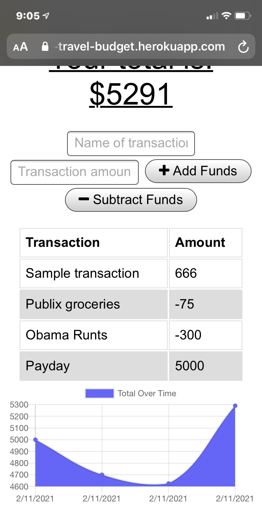

# Travel Budget App

          
 ## Table of Contents for Travel Budget App
          
[Description](#About)
          
[Installation](#Installation)
          
[Usage](#Usage)
          
[Technology used](#Technology)
          
[Contributing](#Contributing)
          
[Questions](#Questions)
          
[Licenses](#Licenses)
          
# About
When users find themselves without an active internet connection, this progressive web application will allows users to add expenses and deposits to their budget with or without a connection. When entering transactions offline, the changes they make to their balance will be be saved until the user has an internet connection upon which they will be saved to the database.
## Installation
Users will navigate to the [github repository](https://github.com/AndreDiop/Travel-Budget) and open the code in their editor of choice and run 'npm install' to get the node files required. Once the files have finished installing, users will be able to start the application on a localhost wit the command 'npm start'.

## Usage
Users will navigate to the deployed site [here](https://the-travel-budget.herokuapp.com/
) and be able to input the name  and amount of the transaction that they are logging and whether the transaction will add funds or subtract funds.

 

Users will then enter the 'Sample Transaction' and the value of 666.

 

 

Users will then see the added entry is inputted whether connected to the internet or not

 

 

##  Technology
Along with javaScript, HTML, and CSS, this app uses Db Atlas as a database and the NPM packages of Mongoose, Express, morgan, and compression.
          
          
## Contributing
I am always accepting contributions, please email me before you make a request
          
## Questions
You can find me on [GitHub](https://www.github.com/AndreDiop) 
You can reach me by email also at ItsjustAndre@gmail.com
## License
This project is covered under the following 
license:
[MIT](https://opensource.org/licenses/MIT)
Copyright 2021

    Permission is hereby granted, free of charge, to any person obtaining a copy of this software and associated documentation files (the "Software"), to deal in the Software without restriction, including without limitation the rights to use, copy, modify, merge, publish, distribute, sublicense, and/or sell copies of the Software, and to permit persons to whom the Software is furnished to do so, subject to the following conditions:
    
    The above copyright notice and this permission notice shall be included in all copies or substantial portions of the Software.
    
    THE SOFTWARE IS PROVIDED "AS IS", WITHOUT WARRANTY OF ANY KIND, EXPRESS OR IMPLIED, INCLUDING BUT NOT LIMITED TO THE WARRANTIES OF MERCHANTABILITY, FITNESS FOR A PARTICULAR PURPOSE AND NONINFRINGEMENT. IN NO EVENT SHALL THE AUTHORS OR COPYRIGHT HOLDERS BE LIABLE FOR ANY CLAIM, DAMAGES OR OTHER LIABILITY, WHETHER IN AN ACTION OF CONTRACT, TORT OR OTHERWISE, ARISING FROM, OUT OF OR IN CONNECTION WITH THE SOFTWARE OR THE USE OR OTHER DEALINGS IN THE SOFTWARE.
    
    
        